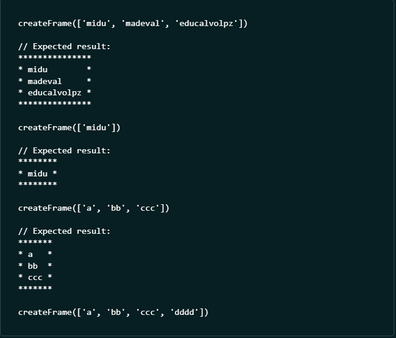

# Challenge 2

Santa Claus 🎅 wants to frame the names of the good children to decorate his workshop 🖼️, but the frame must follow specific rules. Your task is to help the elves generate this magical frame.

Rules:

- Given an array of names, you must create a rectangular frame that contains all of them.
- Each name must be on a line, aligned to the left.
- The frame is built with * and has a border one line thick.
- The width of the frame automatically adapts to the longest name plus a margin of 1 space on each side.

## Example how it works:

## Reference: 
[challenge 2 link to problem](https://adventjs.dev/challenges/2024/2)